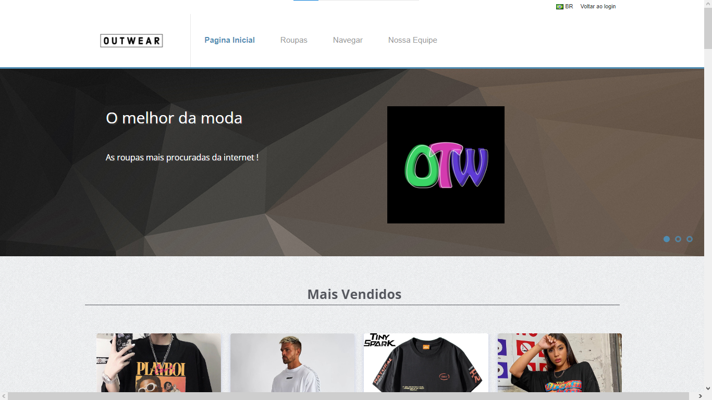
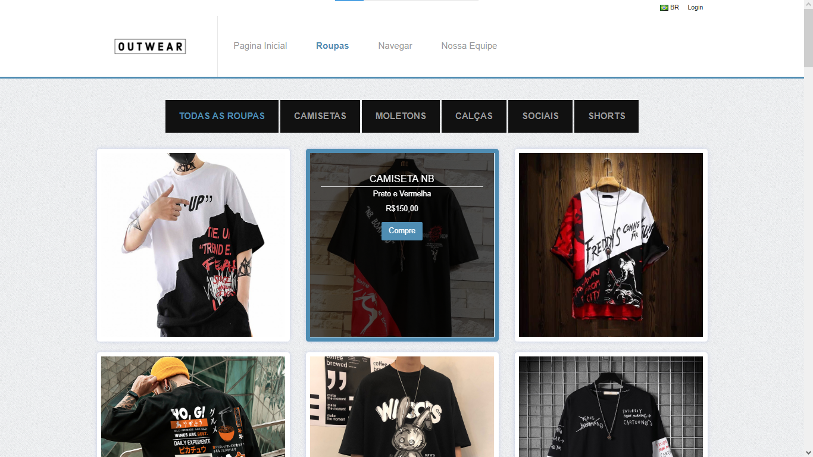
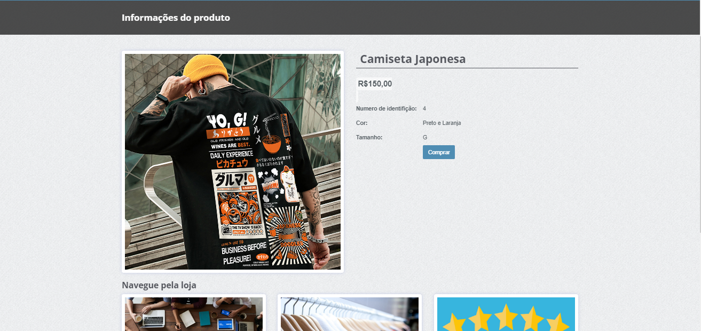
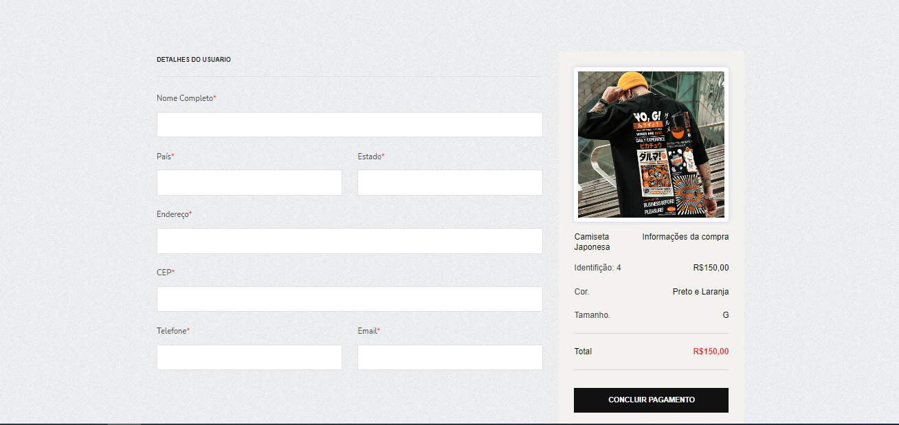
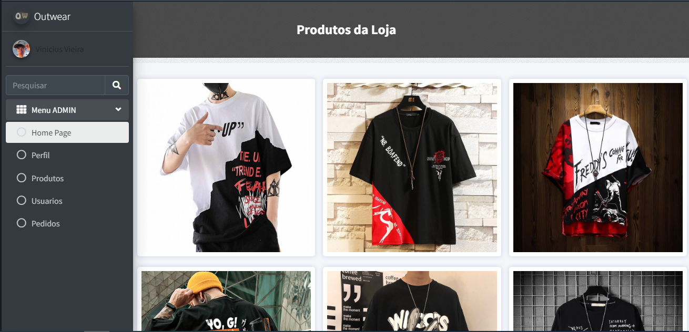
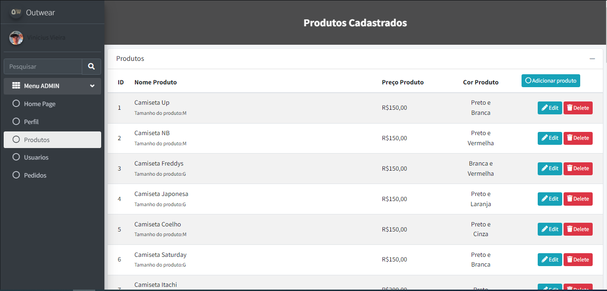
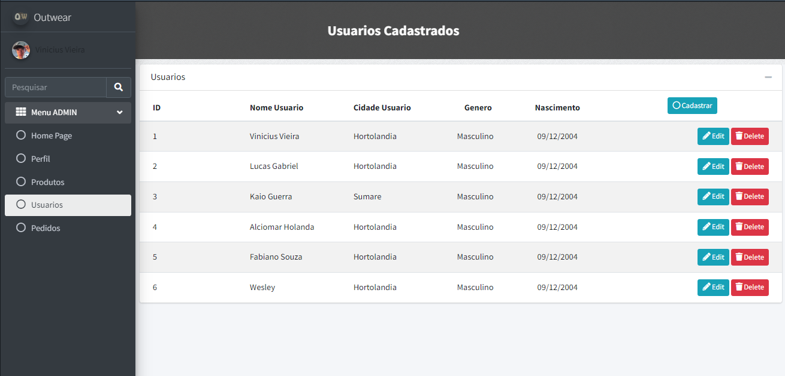

# 🛍️ Outwear

> **Qualidade é a nossa moda.**

A **Outwear** é um projeto de e-commerce desenvolvido como **Trabalho de Conclusão de Curso (TCC)**, em equipe de três integrantes, com o objetivo de criar uma experiência de compra online voltada para roupas e acessórios.

A proposta da marca é oferecer uma plataforma que combine **variedade, qualidade, praticidade e uma experiência de compra próxima do cliente**, tendo como inspiração o modelo de grandes plataformas de comércio eletrônico de moda.

---

## 📌 Sobre o Projeto

A ideia da Outwear surgiu a partir da percepção de duas dificuldades comuns no mercado de moda: a dificuldade de muitas pessoas em encontrar o próprio estilo e a comunicação entre marcas e consumidores.

A partir disso, foi criada uma plataforma de e-commerce focada em vestuário e acessórios, buscando proporcionar uma experiência de compra simples, confortável e acessível.

O conceito da marca também está relacionado ao próprio nome:

- **OUT** → "Fora", representando a ideia de sair do padrão e seguir o próprio estilo.
- **WEAR** → "Vestir", fazendo referência às roupas e vestimentas.

A proposta da Outwear é incentivar o cliente a encontrar e construir sua própria identidade através da moda.

---

## 🎯 Objetivos

O principal objetivo do projeto foi desenvolver uma plataforma de comércio eletrônico capaz de proporcionar uma experiência de compra online completa e intuitiva.

Entre os objetivos da Outwear estão:

- Oferecer uma experiência de compra online diferenciada;
- Disponibilizar variedade de produtos;
- Priorizar qualidade e conforto;
- Facilitar o acesso aos produtos sem a necessidade de deslocamento;
- Aproximar a marca de seus consumidores;
- Oferecer atendimento e suporte aos clientes durante sua experiência na plataforma.

---

## 💡 Proposta da Marca

A Outwear tem como público pessoas que desejam melhorar seu visual, encontrar seu próprio estilo e ter acesso a diferentes opções de roupas e acessórios.

A marca possui uma forte relação com o conceito **streetwear**, associado à essência urbana e cultural de milhares de pessoas ao redor do mundo.

Além da venda de produtos, a proposta também envolve auxiliar o usuário na construção do próprio estilo, apresentando conceitos relacionados a combinações, simplicidade e qualidade.

---

## 🛒 Funcionalidades

O sistema foi desenvolvido com diferentes experiências para **usuários** e **administradores**.

### 👤 Área do Usuário

A área destinada aos clientes contempla a navegação pela loja e o processo de compra dos produtos.

Entre as principais funcionalidades e telas estão:

- Página inicial;
- Navegação pela loja;
- Visualização de produtos;
- Visualização de informações dos produtos;
- Processo de compra;
- Acesso aos produtos disponibilizados pela plataforma.

### 🔐 Área Administrativa

A plataforma possui uma área exclusiva para administração do sistema.

Entre as funcionalidades e telas administrativas estão:

- Página inicial administrativa;
- Perfil do administrador;
- Gerenciamento de produtos;
- Gerenciamento de usuários;
- Administração da plataforma.

---

## 🎨 Conceito de Moda

Além da parte de e-commerce, a Outwear foi planejada como uma marca que busca ajudar seus clientes a desenvolver o próprio estilo.

O projeto apresenta conteúdos relacionados a:

- Combinações de roupas;
- Simplicidade;
- Qualidade acima da quantidade;
- Utilização de acessórios;
- Óculos;
- Colares;
- Cobertura;
- Sobreposição de peças.

Dessa forma, o projeto não se limita à venda de produtos, mas também trabalha a identidade visual e a experiência da marca.

---

## 💻 Tecnologias Utilizadas

A aplicação foi desenvolvida utilizando tecnologias voltadas para desenvolvimento web:

| Tecnologia | Utilização |
|---|---|
| **PHP** | Desenvolvimento da aplicação e regras do sistema |
| **MySQL** | Banco de dados |
| **HTML5** | Estrutura das páginas |
| **CSS3** | Estilização e identidade visual |
| **JavaScript** | Interações e funcionalidades da interface |
| **Bootstrap** | Componentes e responsividade da interface |

---

## 🏗️ Estrutura do Sistema

O projeto foi dividido principalmente em duas áreas:

```text
Outwear
│
├── Área do Usuário
│   ├── Home
│   └── Compra de produtos
│
└── Área Administrativa
    ├── Home
    ├── Perfil
    ├── Produtos
    └── Usuários
```

A separação entre as áreas permite que usuários e administradores tenham experiências diferentes dentro da plataforma, de acordo com suas respectivas funções.

---

## 👥 Desenvolvimento em Equipe

A Outwear foi desenvolvida em **equipe de três integrantes** como parte do Trabalho de Conclusão de Curso.

O desenvolvimento envolveu a construção da identidade da marca, planejamento da solução, desenvolvimento da aplicação e implementação da experiência de e-commerce.

---

## 📚 Contexto Acadêmico

**Projeto:** Outwear  
**Tipo:** Trabalho de Conclusão de Curso (TCC)  
**Formato:** Projeto desenvolvido em equipe  
**Área:** Desenvolvimento de Sistemas / Desenvolvimento Web  
**Segmento:** E-commerce / Moda

---

## 🚀 Resultado

O resultado foi uma plataforma de e-commerce com identidade própria, contemplando tanto a experiência de compra do cliente quanto uma área administrativa para gerenciamento da plataforma.

O projeto buscou unir **desenvolvimento de software, experiência do usuário e construção de marca**, criando uma solução voltada ao comércio online de roupas e acessórios.

---

## 📸 Demonstração

### 🏠 Página Inicial



### 👕 Produtos



### 🛍️ Detalhes do Produto



### 💳 Checkout



### 🔐 Painel Administrativo



### 📦 Gerenciamento de Produtos



### 👥 Gerenciamento de Usuários



---

## 📄 Licença

Este projeto foi desenvolvido para fins **acadêmicos e de portfólio**.